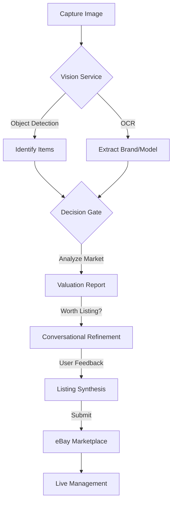

# AI List Assist: Enterprise-Grade Reselling Orchestration

**AI List Assist** is an advanced, end-to-end automation platform for online resellers. It bridges the gap between unstructured visual data (photos) and structured marketplace requirements (eBay listings) using a **Hybrid AI** architecture (Google Gemini 1.5 Flash + Cloud Vision).

---

## 🚀 System Overview

AI List Assist eliminates the manual friction of reselling. From the moment you source an item at a thrift store to the final click of "Publish on eBay," our system orchestrates the entire lifecycle: detection, valuation, refinement, and submission.

### 🌟 Key Features

*   **🤖 Multi-Item Hybrid Vision**: Snap one photo of multiple items; our Vision Service (Gemini 1.5 Flash) identifies and separates them automatically, extracting brand, model, and condition.
*   **⚖️ Decision Gate Valuation Engine**: Instant market analysis providing estimated values, resale scores (1-10), and a "Worth Listing" recommendation based on real-time profitability metrics.
*   **💬 Conversational Listing Assistant**: An AI-driven state machine that guides you through filling in missing eBay item specifics, resolving ambiguities through natural dialogue.
*   **🔌 Direct eBay Publishing**: Secure OAuth 2.0 integration with eBay’s modern **Inventory and Offer APIs** for seamless one-click publishing and active listing management.
*   **📱 Omnichannel Interfaces**:
    *   **Professional Dashboard**: A rich web interface for bulk management, live listing updates, and performance tracking.
    *   **Mobile Valuator Bot**: A dedicated Telegram bot for on-the-go sourcing and instant valuations in the field.
*   **📦 Consignment & Asset Tracking**: (New) Professional-grade system for managing participants, assets, commissions, and document provenance for consignment-based reselling.
*   **💰 API Usage & Cost Tracker**: Real-time monitoring of Vision, Gemini, and eBay API calls with accurate cost estimation for transparent operations.

---

## 🔄 Core Workflow



1.  **Visual Acquisition**: Upload photos via the Web Dashboard or Telegram Bot.
2.  **Hybrid Analysis**: AI detects items, extracts text, and evaluates market potential.
3.  **The Decision Gate**: Filters high-potential items based on a 90-day sold history and demand.
4.  **Guided Refinement**: The Conversational Orchestrator ensures all required eBay aspects (e.g., Size, Color, Material) are met.
5.  **Marketplace Synthesis**: Automated generation and publishing of SEO-optimized eBay listings.
6.  **Live Management**: Update or end active listings directly from the dashboard.

---

## ⚖️ The "Decision Gate" Logic

Maximize ROI by calculating profitability before spending time on the listing process.

| Profitability | Criteria | Recommendation |
| :--- | :--- | :--- |
| **🚀 High** | >$50 value, >30% sell-through | **List Immediately** |
| **✅ Medium** | >$20 value, >20% sell-through | **Worth Listing** |
| **📦 Low** | >$10 value | **Consider Bundling** |
| **♻️ None** | <$10 or no demand | **Donate/Discard** |

---

## 🏗️ Technical Architecture

AI List Assist uses a service-oriented architecture designed for scale and resilience.

### 📁 Project Structure

```text
ai-list-assist/
├── app_enhanced.py           # Main Flask application & Web API
├── your_ebay_valuator_bot.py # Telegram bot interface (Mobile)
├── services/                 # Core Business Logic
│   ├── vision_service.py     # Multi-item detection & OCR (Gemini + Vision)
│   ├── valuation_service.py  # Market analysis & Decision Gate logic
│   ├── listing_synthesis.py  # eBay listing generation engine
│   ├── ebay_integration.py   # eBay API client (Inventory/Offer/Account)
│   ├── consignment_database.py # Consignment & Asset management
│   ├── ebay_token_manager.py # OAuth 2.0 lifecycle management
│   └── valuation_database.py # Persistent storage for analysis history
├── shared/                   # Shared data models (ListingDraft, ItemValuation)
├── templates/                # Professional Web UI (Dashboard)
├── tests/                    # Comprehensive test suite
└── ebayCategories/           # Category-specific mapping data & documentation
```

### 🛠️ Tech Stack
- **Backend**: Python 3.12+ / Flask
- **AI Stack**: Google Cloud Vision & Gemini 1.5 Flash (direct REST integration)
- **Marketplace**: eBay Sell APIs (Inventory, Taxonomy, Account, Analytics)
- **Persistence**: SQLite (Dual-DB strategy: `valuations.db` and `listings.db`)
- **Mobile**: Python Telegram Bot API (async)

---

## 🛠️ Getting Started

### 1. Prerequisites
- Python 3.12+
- Google Cloud Project (Vision and Gemini APIs enabled).
- eBay Developer Account (Sandbox or Production).
- Telegram Bot Token (from @BotFather).

### 2. Installation
```bash
# Clone the repository
git clone <repository-url>
cd ai-list-assist

# Install dependencies
pip install -r requirements.txt
```

### 3. Configuration
Create a `.env` file in the root directory:
```env
SECRET_KEY=your_flask_secret_key
GOOGLE_API_KEY=your_google_api_key
EBAY_CLIENT_ID=your_ebay_client_id
EBAY_CLIENT_SECRET=your_ebay_client_secret
EBAY_RU_NAME=your_ebay_redirect_uri_name
TELEGRAM_BOT_TOKEN=your_telegram_bot_token
EBAY_USE_SANDBOX=True
```

### 4. Launching
```bash
# Start the Dashboard
python app_enhanced.py

# Start the Telegram Bot
python your_ebay_valuator_bot.py
```
Access the dashboard at: **http://localhost:5000**

---

## 📱 How to Use

### Web Dashboard
1.  **Analyze**: Upload an image. The Hybrid Vision service detects items and provides valuations.
2.  **Review**: See API usage costs in real-time via the built-in tracker.
3.  **Refine**: Enter the conversational flow to provide missing eBay specifics.
4.  **Publish**: Review the synthesized listing and publish to eBay.
5.  **Manage**: Use the "Live Listings" tab to edit or end active listings.

### Telegram Bot
1.  **Start**: Send `/start` to your bot.
2.  **Snap**: Send a photo of an item while sourcing.
3.  **Evaluate**: Receive instant Brand, Model, and Category identification on your phone.

---

## 🧪 Development & Testing

We maintain high code quality through automated testing.

```bash
# Run the full test suite
export PYTHONPATH=$PYTHONPATH:/path/to/extra/packages
export SECRET_KEY=test_secret EBAY_CLIENT_ID=test EBAY_CLIENT_SECRET=test GOOGLE_API_KEY=test
python -m unittest discover tests
```

### 🔒 Operational Boundaries
- **Strict Credential Policy**: Never hardcode secrets. All credentials must be in `.env`.
- **Modern APIs**: Always use the eBay REST/JSON Inventory API over legacy Trading APIs.
- **Data Integrity**: Analysis is stored in `valuations.db`; listing state in `listings.db`.

---

## 📄 Documentation
- [Setup Guide](SETUP_GUIDE.md)
- [Valuation Data Guide](VALUATION_DATA_GUIDE.md)
- [eBay Listing Mapping](EBAY_LISTING_MAPPING.md)
- [Agent Guidelines](AGENTS.md)
