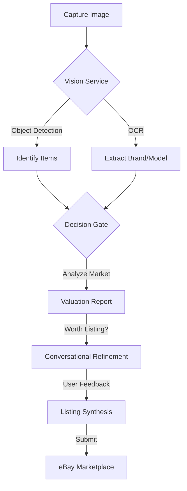

# AI List Assist: Enterprise-Grade Reselling Orchestration

AI List Assist is a powerful, end-to-end system designed to automate the lifecycle of online reselling. It serves as an enterprise-grade orchestration layer that bridges unstructured visual data and structured e-commerce requirements using **Hybrid AI** (Google Gemini 1.5 Flash + Cloud Vision).

---

## 🚀 System Overview

AI List Assist eliminates the friction of manual listing. By combining cutting-edge vision AI with eBay's modern Sell APIs, the system transforms simple photos into marketplace-ready listings with high-accuracy valuations.

### 🌟 Key Features

*   **🤖 Multi-Item Hybrid Vision**: Snap one photo of multiple items; our Vision Service (Google Cloud Vision + Gemini 1.5 Flash) identifies and separates them automatically, extracting brand, model, and condition.
*   **⚖️ Decision Gate Valuation**: Our proprietary valuation engine provides instant market analysis, estimated values, and a "Worth Listing" recommendation based on real-time data.
*   **💬 Conversational Listing Assistant**: A guided, AI-driven state machine asks only the necessary questions to fill in missing eBay item specifics, resolving ambiguities progressively.
*   **🔌 Direct eBay Publishing**: Secure OAuth 2.0 integration with eBay’s modern Inventory and Offer APIs for one-click publishing.
*   **📱 Omnichannel Interfaces**:
    *   **Web Dashboard**: A professional desktop interface for bulk management and detailed analysis.
    *   **Mobile Valuator Bot**: A dedicated Telegram bot for on-the-go valuations while sourcing at thrift stores or garage sales.
*   **📊 Live Performance Tracking**: Manage active listings, view sales potential, and track your valuation history in one place.

---

## 🔄 Core Workflow



1.  **Visual Acquisition**: Capture photos in various modes (Studio, Sourcing, or Bulk).
2.  **Hybrid Analysis**: AI detects items, extracts text, and evaluates market potential.
3.  **The Decision Gate**: Filters high-potential items based on profitability metrics.
4.  **Guided Refinement**: The Conversational Orchestrator ensures all required eBay aspects are met.
5.  **Marketplace Synthesis**: Automated generation and publishing of optimized eBay listings.

---

## ⚖️ The "Decision Gate" Logic

Maximize ROI by calculating profitability before spending time on the listing process:

| Profitability | Criteria | Recommendation |
| :--- | :--- | :--- |
| **🚀 High** | >$50 value, >30% sell-through | **List Immediately** |
| **✅ Medium** | >$20 value, >20% sell-through | **Worth Listing** |
| **📦 Low** | >$10 value | **Consider Bundling** |
| **♻️ None** | <$10 or no demand | **Donate/Discard** |

---

## 🏗️ Technical Architecture

AI List Assist is built with a service-oriented architecture for scale and resilience:

### 📁 Project Structure

```
ai-list-assist/
├── app_enhanced.py           # Main Flask application & API
├── your_ebay_valuator_bot.py # Telegram bot interface
├── services/                 # Core business logic
│   ├── vision_service.py     # Multi-item detection & OCR
│   ├── conversation_orchestrator.py # AI State Machine
│   ├── listing_synthesis.py  # Listing generation engine
│   ├── ebay_integration.py   # eBay API client (Inventory/Offer)
│   ├── valuation_service.py  # Market analysis logic
│   └── valuation_database.py # Persistent storage
├── shared/                   # Shared data models & schemas
├── templates/                # Web UI (Dashboard & Index)
├── tests/                    # Comprehensive test suite
├── ebayCategories/           # Category-specific mapping data
└── docs/                     # Detailed architecture documentation
```

*   **Backend**: Python 3.12+ / Flask
*   **AI Stack**: Google Cloud Vision & Gemini 1.5 Flash (via direct REST integration)
*   **Marketplace**: eBay Sell APIs (Inventory, Taxonomy, Account, Analytics)
*   **Persistence**: SQLite (Dual-database strategy for valuations and listing states)
*   **Mobile**: Python Telegram Bot API

---

## 🛠️ Getting Started

### 1. Prerequisites
- Python 3.12+
- Google Cloud Project with Vision and Gemini APIs enabled.
- eBay Developer Account.

### 2. Installation
```bash
# Clone the repository
git clone <repository-url>
cd ai-list-assist

# Install dependencies
pip install -r requirements.txt
```

### 3. Configuration
Create a `.env` file in the root directory:
```env
SECRET_KEY=your_flask_secret_key
GOOGLE_API_KEY=your_google_api_key
EBAY_CLIENT_ID=your_ebay_client_id
EBAY_CLIENT_SECRET=your_ebay_client_secret
EBAY_RU_NAME=your_ebay_redirect_uri_name
TELEGRAM_BOT_TOKEN=your_telegram_bot_token
```

### 4. Launching
```bash
# Start the web server
python app_enhanced.py

# Start the Telegram bot (optional)
python your_ebay_valuator_bot.py
```
Access the dashboard at: **http://localhost:5000**

---

## 🧪 Development & Testing

We maintain high code quality through automated testing:

```bash
# Run the full test suite
export SECRET_KEY=test EBAY_CLIENT_ID=test EBAY_CLIENT_SECRET=test GOOGLE_API_KEY=test
python -m unittest discover tests
```

---

## 📄 License
This project is licensed under the terms specified in the repository.
