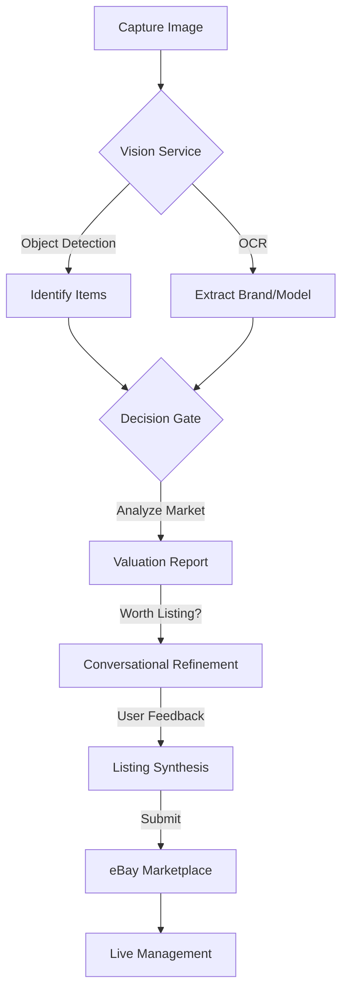

# AI List Assist: Enterprise-Grade Reselling Orchestration

**AI List Assist** is an advanced, end-to-end automation platform for professional online resellers. It bridges the gap between unstructured visual data (photos) and structured marketplace requirements (eBay listings) using a **Hybrid AI** architecture (Google Gemini 1.5 Flash + Cloud Vision).

---

## 🚀 System Overview

AI List Assist is a programmatic orchestration layer designed to transform raw visual assets into optimized e-commerce data. From individual sourcing to high-volume commercial operations, the system automates the entire lifecycle: **Detection, Valuation, Taxonomy Validation, and Automated Submission.**

### 🌟 Key Features

*   **🤖 Multi-Item Hybrid Vision**: Snap one photo of multiple items; our Vision Service (Google Cloud Vision + Gemini 1.5 Flash) identifies and separates them automatically, extracting brand, model, and condition.
*   **⚖️ Decision Gate Valuation Engine**: Instant market analysis providing estimated values, resale scores (1-10), and a "Worth Listing" recommendation based on real-time profitability metrics.
*   **💬 Conversational Listing Assistant**: An AI-driven state machine that guides you through filling in missing eBay item specifics, resolving ambiguities through natural dialogue.
*   **🔌 Direct eBay Publishing**: Secure OAuth 2.0 integration with eBay’s modern **Inventory and Offer APIs** for seamless one-click publishing.
*   **📦 Consignment & Asset Tracking**: Manage participants with KYC status, tax nexus codes, and commission tracking at scale.
*   **💰 API Usage & Cost Tracker**: Real-time monitoring of AI and marketplace API calls with accurate cost estimation for transparent operations.

---

## 🎮 Operational Modes

AI List Assist adapts to your specific reselling workflow through dedicated modes:

| Mode | Purpose | Target User |
| :--- | :--- | :--- |
| **🏠 Locker Mode** | Secure storage and management of existing inventory. | Personal Resellers |
| **🔍 Sourcing Mode** | On-the-go valuation and market analysis in the field. | Thrift/Flea Market Hunters |
| **🤝 Consignment** | Tracking assets, commissions, and KYC for third-party sellers. | Consignment Businesses |
| **🏬 Studio Mode** | High-speed, bulk photo intake and batch processing. | Commercial Warehouses |

---

## 🔄 Core Workflow



1.  **Visual Acquisition**: Upload photos via the Web Dashboard or Telegram Bot.
2.  **Hybrid Analysis**: AI detects items, extracts text, and evaluates market potential.
3.  **The Decision Gate**: Filters items based on 90-day sold history and demand.
4.  **Guided Refinement**: The Conversational Orchestrator resolves missing eBay aspects.
5.  **Marketplace Synthesis**: Automated generation of SEO-optimized eBay listings.

---

## 🏗️ Technical Architecture

### 🛠️ Tech Stack
- **Backend**: Python 3.12 - 3.14.2 (Flask)
- **AI Stack**: Google Cloud Vision & Gemini 1.5 Flash (Direct REST)
- **Marketplace**: eBay Sell APIs (Inventory, Taxonomy, Account, Analytics)
- **Persistence**: SQLite (Dual-DB strategy: `valuations.db` and `listings.db`)
- **Mobile**: Python Telegram Bot API (Async)

### 📁 Project Structure
- `app_enhanced.py`: Main Flask application and Web API.
- `your_ebay_valuator_bot.py`: Telegram bot for mobile sourcing.
- `services/`: Modular business logic (Vision, Valuation, Listing, eBay Integration).
- `shared/`: Canonical data models (ListingDraft, ItemValuation).
- `templates/`: Professional Dashboard UI.

---

## ⚙️ Getting Started

### 1. Installation
```bash
# Clone the repository
git clone <repository-url>
cd ai-list-assist

# Install dependencies
pip install -r requirements.txt
```

### 2. Quick Start with Docker
```bash
# Launch full stack (App + Redis + DBs)
docker-compose -f docker-compose.dev.yml up --build
```

### 3. Configuration
Create a `.env` file with your credentials:
```env
SECRET_KEY=...
GOOGLE_API_KEY=...
EBAY_CLIENT_ID=...
EBAY_CLIENT_SECRET=...
TELEGRAM_BOT_TOKEN=...
EBAY_USE_SANDBOX=True
```

---

## 📱 Interface Guide

### Web Dashboard (http://localhost:5000)
- **Analyze**: Upload images for instant AI valuation.
- **Drafts**: Refine and prepare listings for eBay.
- **Live**: Manage active eBay listings directly.
- **Stats**: Track performance and API usage costs.

### Telegram Valuator Bot
- **Snap**: Send a photo of an item while sourcing.
- **Evaluate**: Receive instant Brand, Model, and Category identification.

---

## 📅 Roadmap

- **Phase 1: Automation** (Current)
  - [x] Modular service architecture.
  - [x] Business Policy integration.
  - [ ] Return Window Lock logic.
- **Phase 2: Analytics**
  - [ ] Consignment Payout Dashboard.
  - [ ] Market Trend Analysis.
- **Phase 3: Scale**
  - [ ] Multi-Marketplace Support (Mercari, Poshmark).
  - [ ] Studio Mode high-speed intake.

---

## 📄 Documentation
- [Setup Guide](SETUP_GUIDE.md)
- [Valuation Data Guide](VALUATION_DATA_GUIDE.md)
- [eBay Listing Mapping](EBAY_LISTING_MAPPING.md)
- [Agent Guidelines](AGENTS.md)
