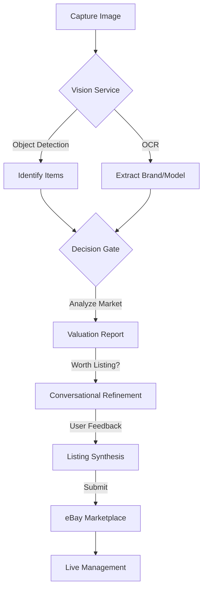

# AI List Assist: Enterprise-Grade Reselling Orchestration

**AI List Assist** is an advanced, end-to-end automation platform for professional online resellers. It bridges the gap between unstructured visual data (photos) and structured marketplace requirements (eBay listings) using a **Hybrid AI** architecture (Google Gemini 1.5 Flash + Cloud Vision).

---

## 🚀 System Overview

AI List Assist is a programmatic orchestration layer designed to transform raw visual assets into optimized e-commerce data. From individual sourcing to high-volume commercial operations, the system automates the entire lifecycle: **Detection, Valuation, Taxonomy Validation, and Automated Submission.**

### 🌟 Key Features

*   **🤖 Multi-Item Hybrid Vision**: Snap one photo of multiple items; our Vision Service identifies and separates them automatically, extracting brand, model, and condition.
*   **⚖️ Decision Gate Valuation Engine**: Instant market analysis providing estimated values, resale scores (1-10), and a "Worth Listing" recommendation based on real-time profitability metrics.
*   **💬 Conversational Listing Assistant**: An AI-driven state machine that guides you through filling in missing eBay item specifics, resolving ambiguities through natural dialogue.
*   **🔌 Direct eBay Publishing**: Secure OAuth 2.0 integration with eBay’s modern **Inventory and Offer APIs** for seamless one-click publishing and state reconciliation.
*   **🤝 Consignment & Asset Tracking**: Manage participants with KYC status, tax nexus codes, and commission tracking at scale via the `ConsignmentDatabase`.
*   **💰 API Usage & Cost Tracker**: Real-time monitoring of AI and marketplace API calls with accurate cost estimation for transparent operations.
*   **💾 Offline-First Resilience**: Local caching and state reconciliation ensure work continues even when network signals drop.

---

## 🎮 Operational Modes

AI List Assist adapts to your specific reselling workflow through four dedicated modes:

| Mode | Purpose | Target User |
| :--- | :--- | :--- |
| **🏠 Locker Mode** | Secure storage and management of existing inventory. | Personal Resellers |
| **🔍 Sourcing Mode** | On-the-go valuation and market analysis in the field. | Thrift/Flea Market Hunters |
| **🤝 Consignment** | Tracking assets, commissions, and KYC for third-party sellers. | Consignment Businesses |
| **🏬 Studio Mode** | High-speed, bulk photo intake and batch processing. | Commercial Warehouses |

---

## 🔄 Core Workflow



1.  **Visual Acquisition**: Upload photos via the Web Dashboard or the Telegram Bot (`your_ebay_valuator_bot.py`).
2.  **Hybrid Analysis**: AI detects items, extracts text, and evaluates market potential.
3.  **The Decision Gate**: Filters items based on 90-day sold history and demand.
4.  **Guided Refinement**: The Conversational Orchestrator resolves missing eBay aspects.
5.  **Marketplace Synthesis**: Automated generation of SEO-optimized eBay listings.

---

## 🏗️ Technical Architecture

### 🛠️ Tech Stack
- **Backend**: Python 3.12+ - Utilizing Flask 3.0.0 for modern async features and strict type hinting.
- **AI Stack**: Google Cloud Vision & Gemini 1.5 Flash (Direct REST Integration).
- **Marketplace**: eBay Sell APIs (Inventory, Taxonomy, Account, Analytics) - Modern REST/JSON model.
- **Persistence**: Hybrid Storage Strategy:
    - **Triple-SQLite**: `valuations.db` (trends), `listings.db` (eBay state), and `consignment.db` (KYC/Assets).
    - **PostgreSQL**: Centralized `ebay_market_data` for long-term trend analysis (supported via `seed_db.py`).
    - **Redis**: High-speed caching for latest market trends and session data.
- **Mobile**: Python Telegram Bot API (`your_ebay_valuator_bot.py` for async field sourcing).
- **Containerization**: Docker & Docker Compose (Multi-container setup for scalable deployment).

### 📁 Modular Service System
The platform is built on 13 specialized services:
- `VisionService`: Hybrid OCR and object detection using Cloud Vision and Gemini.
- `ValuationService`: Real-time market analysis and profitability scoring.
- `ConversationOrchestrator`: Multi-turn dialogue for listing detail gathering.
- `ListingSynthesisEngine`: SEO-optimized title and description generation.
- `eBayIntegration`: Modern REST Inventory/Offer API management.
- `EBayCategoryService`: Parameterized category tree and aspect mapping.
- `EBayTokenManager`: OAuth 2.0 lifecycle with auto-refresh and in-memory caching.
- `CategoryDetailGenerator`: Dynamic question generation based on eBay taxonomy.
- `DraftImageManager`: Local management and cleanup of listing visual assets.
- `ConsignmentDatabase`: Participant KYC and asset tracking management.
- `ValuationDatabase`: Thread-local SQLite persistence with WAL enabled.
- `GeminiRestClient`: Direct REST integration with Gemini 1.5 Flash.
- `MockValuationService`: High-fidelity simulation for development and testing.

---

## ⚙️ Getting Started

### 1. Prerequisites
- **Python 3.12+** (Required for core dependencies).
- **Google Cloud API Key** (Vision + Gemini 1.5 Flash).
- **eBay Developer Account** (Client ID + Secret).
- **Telegram Bot Token** (Optional, for mobile sourcing).

### 2. Installation
```bash
# Clone the repository
git clone <repository-url>
cd ai-list-assist

# Install dependencies
pip install -r requirements.txt
```

### 3. Quick Start with Docker
The fastest way to launch the full stack (App + Redis + DBs):
```bash
docker-compose -f docker-compose.dev.yml up --build
```

### 4. Configuration
Create a `.env` file with your credentials:
```env
SECRET_KEY=...
GOOGLE_API_KEY=...
EBAY_CLIENT_ID=...
EBAY_CLIENT_SECRET=...
TELEGRAM_BOT_TOKEN=...
EBAY_USE_SANDBOX=True
EBAY_CATEGORY_TREE_ID=0
```

---

## 📱 Interface Guide

### Web Dashboard (http://localhost:5000)
- **Analyze**: Upload images for instant AI valuation and "Worth Listing" checks.
- **Drafts**: Refine and prepare listings with guided category aspect resolution.
- **Live**: Manage active eBay listings, refresh state, and end items.
- **Stats**: Track performance, resale success, and API usage costs.
- **Accessibility**: ARIA-compliant dashboard with keyboard-triggerable upload zones (`tabindex="0"`).

### Telegram Valuator Bot (`your_ebay_valuator_bot.py`)
- **Snap**: Send a photo of an item while sourcing in the field.
- **Evaluate**: Receive instant Brand, Model, and Category identification on the go.

---

## 📅 Roadmap

- **Phase 1: Automation** (Complete)
  - [x] Modular service architecture and Hybrid Vision/Valuation pipeline.
  - [x] Modern eBay REST Inventory/Offer API integration.
  - [x] Triple-DB state reconciliation strategy.
- **Phase 2: Reporting & Analytics** (In Progress)
  - [ ] Consignment Payout Dashboard and Market Trend Analysis.
  - [ ] Postgres/Redis seeding for enterprise-scale market data.
- **Phase 3: Scale** (Planned)
  - [ ] Omnichannel support (Mercari, Poshmark) and Studio Mode bulk intake.

---

## 📄 Documentation
- [Setup Guide](SETUP_GUIDE.md) - Detailed installation and troubleshooting.
- [Valuation Data Guide](VALUATION_DATA_GUIDE.md) - Deep dive into valuation models.
- [eBay Listing Mapping](EBAY_LISTING_MAPPING.md) - Schema mappings for eBay Inventory API.
- [Agent Guidelines](AGENTS.md) - Technical standards and architectural context.

---

**AI List Assist** - Turning reselling into a science.
