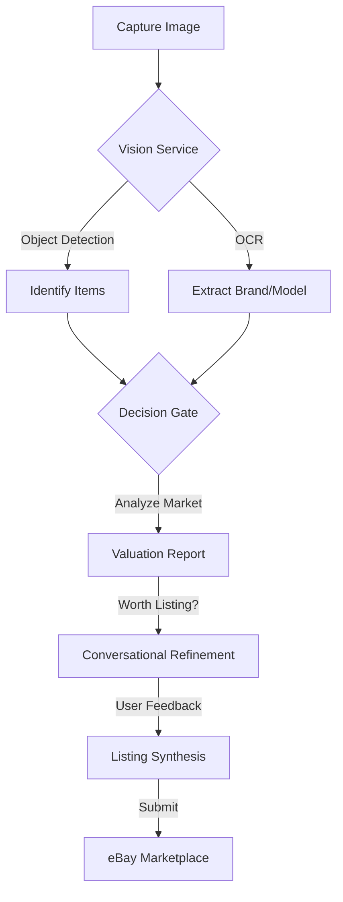

# AI List Assist: The Ultimate eBay Reselling Copilot

AI List Assist is a powerful, end-to-end system designed to automate the lifecycle of online reselling. By combining Google's Gemini Vision AI with eBay's modern Sell APIs, the system transforms unstructured photos into structured, marketplace-ready listings with high-accuracy valuations.

---

## 🚀 System Overview

AI List Assist eliminates the friction of manual listing. Whether you're a professional reseller or just clearing out your garage, our system helps you decide **what's worth listing** and gets it live on eBay in seconds.

### 🌟 Key Features

*   **🤖 Multi-Item AI Detection**: Snap one photo of multiple items; our Vision Service (Google Cloud Vision + Gemini 1.5 Flash) identifies and separates them automatically.
*   **⚖️ Decision Gate Valuation**: Instant market analysis provides estimated values, condition scores (1-10), and a "Worth Listing" recommendation.
*   **💬 Conversational Listing Assistant**: A guided, AI-driven interface asks only the necessary questions to fill in missing eBay item specifics.
*   **🔌 Direct eBay Publishing**: Secure OAuth 2.0 integration with eBay’s modern Inventory and Offer APIs for one-click publishing.
*   **📱 Mobile Valuator Bot**: A dedicated Telegram bot for on-the-go valuations while sourcing at thrift stores or garage sales.
*   **📊 Live Dashboard**: Manage your active listings, view sales performance, and track your valuation history in one place.

---

## 🔄 Core Workflow



1.  **Capture**: Upload a photo of one or more items.
2.  **Analyze**: AI detects items, extracts text, and evaluates market potential.
3.  **Decide**: The "Decision Gate" filters high-potential items based on profitability.
4.  **Refine**: Answer a few guided questions to perfect the listing details.
5.  **Publish**: One-click upload to your eBay store.

---

## ⚖️ The "Decision Gate" Logic

Our proprietary valuation engine helps you maximize ROI by calculating profitability before you spend time listing:

| Profitability | Criteria | Recommendation |
| :--- | :--- | :--- |
| **High** | >$50 value, >30% sell-through | **List Immediately** |
| **Medium** | >$20 value, >20% sell-through | **Worth Listing** |
| **Low** | >$10 value | **Consider Bundling** |
| **None** | <$10 or no demand | **Donate/Discard** |

---

## 🏗️ Technical Architecture

AI List Assist is built with a service-oriented architecture for scale and resilience:

### 📁 Project Structure

```
ai-list-assist/
├── app_enhanced.py           # Main Flask application & API
├── your_ebay_valuator_bot.py # Telegram bot interface
├── services/                 # Core business logic
│   ├── vision_service.py     # Multi-item detection & OCR
│   ├── valuation_database.py # Persistent storage for analysis
│   ├── listing_synthesis.py  # Listing generation engine
│   ├── ebay_integration.py   # eBay API client
│   └── ...                   # Other specialized services
├── shared/                   # Shared data models
│   ├── models.py             # Dataclasses (ListingDraft, ItemValuation)
│   └── schemas/              # Validation schemas
├── templates/                # Web UI components
├── tests/                    # Comprehensive test suite
├── ebayCategories/           # Category-specific mapping data
├── SETUP_GUIDE.md            # Environment and API setup guide
├── VALUATION_DATA_GUIDE.md   # AI valuation logic guide
└── EBAY_LISTING_MAPPING.md   # eBay field mapping guide
```

*   **Backend**: Python 3.12+ / Flask
*   **AI Services**: Google Cloud Vision API & Gemini 1.5 Flash (via direct REST integration)
*   **Marketplace Integration**: eBay Sell APIs (Inventory, Taxonomy, Account, Analytics)
*   **Persistence**: Dual SQLite strategy
    *   `valuations.db`: Tracks analysis history and AI performance.
    *   `listings.db`: Manages the state of active listing workflows.
*   **Frontend**: Responsive Dashboard (HTML5, JavaScript, Tailwind-style CSS)
*   **Mobile Interface**: Telegram Bot (via `python-telegram-bot`)

---

## 🛠️ Getting Started

### 1. Prerequisites
- Python 3.12+
- Google Cloud Project with Vision and Gemini APIs enabled.
- eBay Developer Account (Production or Sandbox).

### 2. Installation
```bash
# Clone the repository
git clone <repository-url>
cd ai-list-assist

# Install dependencies
pip install -r requirements.txt
```

### 3. Configuration
Create a `.env` file in the root directory:
```env
# Flask Configuration
SECRET_KEY=your_flask_secret_key

# Google AI Keys
GOOGLE_API_KEY=your_google_api_key

# eBay API Keys
EBAY_CLIENT_ID=your_ebay_client_id
EBAY_CLIENT_SECRET=your_ebay_client_secret
EBAY_RU_NAME=your_ebay_redirect_uri_name

# Telegram Bot (Optional)
TELEGRAM_BOT_TOKEN=your_telegram_bot_token
```

### 4. Running the Application
```bash
# 1. Initialize databases and start the web server
python app_enhanced.py

# 2. Start the Telegram bot (in a separate terminal)
python your_ebay_valuator_bot.py
```
Access the dashboard at: **http://localhost:5000**

---

## 🧪 Development & Testing

We maintain high code quality through comprehensive testing:

```bash
# Run the full test suite
python -m unittest discover tests
```

**Key Test Areas:**
- `tests/test_ebay_oauth_logic.py`: Verifies secure authentication.
- `tests/test_valuation_database.py`: Ensures data persistence.
- `tests/test_listing_reconstruction.py`: Validates listing generation.

---

## 📖 Related Documentation

- [Setup Guide](SETUP_GUIDE.md): Detailed environment and API setup instructions.
- [Valuation Guide](VALUATION_DATA_GUIDE.md): Deep dive into the AI valuation and decision logic.
- [eBay Mapping](EBAY_LISTING_MAPPING.md): Detailed breakdown of how AI data maps to eBay fields.

---

## 📄 License
This project is licensed under the terms specified in the repository.
