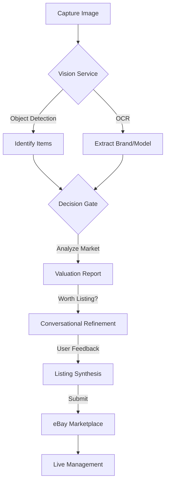

# AI List Assist: Enterprise-Grade Reselling Orchestration

**AI List Assist** is an advanced, end-to-end automation platform for professional online resellers. It bridges the gap between unstructured visual data (photos) and structured marketplace requirements (eBay listings) using a **Hybrid AI** architecture (Google Gemini 1.5 Flash + Cloud Vision).

---

## 🚀 System Overview

AI List Assist is a programmatic orchestration layer designed to transform raw visual assets into optimized e-commerce data. From individual sourcing to high-volume commercial operations, the system automates the entire lifecycle: **Detection, Valuation, Taxonomy Validation, and Automated Submission.**

### 🌟 Key Features

*   **🤖 Multi-Item Hybrid Vision**: Snap one photo of multiple items; our Vision Service identifies and separates them automatically, extracting brand, model, and condition.
*   **⚖️ Decision Gate Valuation Engine**: Instant market analysis providing estimated values, resale scores (1-10), and a "Worth Listing" recommendation based on real-time profitability metrics.
*   **💬 Conversational Listing Assistant**: An AI-driven state machine that guides you through filling in missing eBay item specifics, resolving ambiguities through natural dialogue.
*   **🔌 Direct eBay Publishing**: Secure OAuth 2.0 integration with eBay’s modern **Inventory and Offer APIs** for seamless one-click publishing and state reconciliation.
*   **🤝 Consignment & Asset Tracking**: Manage participants with KYC status, tax nexus codes, and commission tracking at scale via the `ConsignmentDatabase`.
*   **💰 API Usage & Cost Tracker**: Real-time monitoring of AI and marketplace API calls with accurate cost estimation for transparent operations.
*   **💾 Offline-First Resilience**: Local caching and state reconciliation ensure work continues even when network signals drop.
*   **🎨 Palette UX**: ARIA-compliant dashboard with full keyboard navigation support (`tabindex="0"`) and responsive design.

---

## 🎮 Operational Modes

AI List Assist adapts to your specific reselling workflow through four dedicated modes:

| Mode | Purpose | Target User |
| :--- | :--- | :--- |
| **🏠 Locker Mode** | Secure storage and management of existing inventory. | Personal Resellers |
| **🔍 Sourcing Mode** | On-the-go valuation and market analysis in the field. | Thrift/Flea Market Hunters |
| **🤝 Consignment** | Tracking assets, commissions, and KYC for third-party sellers. | Consignment Businesses |
| **🏬 Studio Mode** | High-speed, bulk photo intake and batch processing. | Commercial Warehouses |

---

## 🔄 Core Workflow



1.  **Visual Acquisition**: Upload photos via the Web Dashboard or the Telegram Bot (`your_ebay_valuator_bot.py`).
2.  **Hybrid Analysis**: AI detects items, extracts text, and evaluates market potential.
3.  **The Decision Gate**: Filters items based on 90-day sold history and demand.
4.  **Guided Refinement**: The Conversational Orchestrator resolves missing eBay aspects.
5.  **Marketplace Synthesis**: Automated generation of SEO-optimized eBay listings.

---

## 🏗️ Technical Architecture

### 🛠️ Tech Stack
- **Backend**: Python 3.12+ - Utilizing Flask 3.0.0 for modern async features and strict type hinting.
- **AI Stack**: Google Cloud Vision & Gemini 1.5 Flash (Direct REST Integration, avoiding protobuf issues).
- **Marketplace**: eBay Sell APIs (Inventory, Taxonomy, Account, Analytics) - Modern REST/JSON model.
- **Persistence**: **Triple-DB Strategy** using SQLite:
    - `valuations.db`: Tracks analysis history and market trends.
    - `listings.db`: Stores eBay inventory/offer state and draft data.
    - `consignment.db`: Manages participant data, KYC, and asset tracking.
- **Scalability**: PostgreSQL (`ebay_market_data`) and Redis (latest trends) supported for enterprise deployments.
- **Mobile**: Async Python Telegram Bot (`your_ebay_valuator_bot.py`) for field sourcing.
- **Infrastructure**: Docker & Docker Compose (Multi-container setup).

### 📁 Modular Service System
The platform is built on 13 specialized services:
- `VisionService`: Hybrid OCR and object detection.
- `ValuationService`: Real-time market analysis and profitability scoring.
- `ConversationOrchestrator`: Multi-turn dialogue for listing detail gathering.
- `ListingSynthesisEngine`: SEO-optimized title and description generation.
- `eBayIntegration`: Modern REST Inventory/Offer API management with idempotency support.
- `EBayCategoryService`: Parameterized category tree and aspect mapping.
- `EBayTokenManager`: Centralized OAuth 2.0 lifecycle with auto-refresh.
- `CategoryDetailGenerator`: Optimized question generation (30x speedup via O(N+M) mapping).
- `DraftImageManager`: Local management and cleanup of listing visual assets.
- `ConsignmentDatabase`: Participant KYC and asset tracking management.
- `ValuationDatabase`: Thread-local SQLite persistence with WAL enabled.
- `GeminiRestClient`: Direct REST integration with Gemini 1.5 Flash.
- `MockValuationService`: High-fidelity simulation for development and testing.

---

## ⚙️ Getting Started

### 1. Prerequisites
- **Python 3.12+** (Development environment uses 3.12.12).
- **Google Cloud API Key** (Vision + Gemini 1.5 Flash).
- **eBay Developer Account** (Client ID + Secret).
- **Telegram Bot Token** (Optional, for mobile sourcing).

### 2. Installation
```bash
# Clone the repository
git clone <repository-url>
cd ai-list-assist

# Install dependencies
pip install -r requirements.txt
```

### 3. Configuration
Create a `.env` file with your credentials:
```env
SECRET_KEY=...
API_KEY=... # Custom API Key for endpoint protection
GOOGLE_API_KEY=...
EBAY_CLIENT_ID=...
EBAY_CLIENT_SECRET=...
TELEGRAM_BOT_TOKEN=...
EBAY_USE_SANDBOX=True
EBAY_CATEGORY_TREE_ID=0
```

### 4. Launching the System
```bash
# Start via Docker (Recommended)
docker-compose -f docker-compose.dev.yml up --build

# Or start manually
python app_enhanced.py
```

---

## 📱 Interface Guide

### Web Dashboard (http://localhost:5000)
- **Analyze**: Upload images for instant AI valuation. Secured via `Authorization: Bearer <API_KEY>`.
- **Drafts**: Refine and prepare listings with guided category aspect resolution.
- **Live**: Manage active eBay listings, refresh state, and end items.
- **Stats**: Track performance and API usage costs.
- **Accessibility**: Keyboard-triggerable upload zones (`Enter`/`Space`) and ARIA-compliant forms.

### Telegram Valuator Bot (`your_ebay_valuator_bot.py`)
- Snap a photo in the field for instant valuation and sourcing advice.

---

## 🧪 Testing
Run the comprehensive test suite with:
```bash
export PYTHONPATH=$PYTHONPATH:.
python -m pytest tests/ -v
```

---

## 📅 Roadmap

- **Phase 1: Automation** (Complete) - Core Hybrid Vision and eBay REST integration.
- **Phase 2: Reporting & Analytics** (In Progress) - Consignment dashboards and trend analysis.
- **Phase 3: Scale** (Planned) - Omnichannel support (Mercari, Poshmark).

---

**AI List Assist** - Turning reselling into a science.
